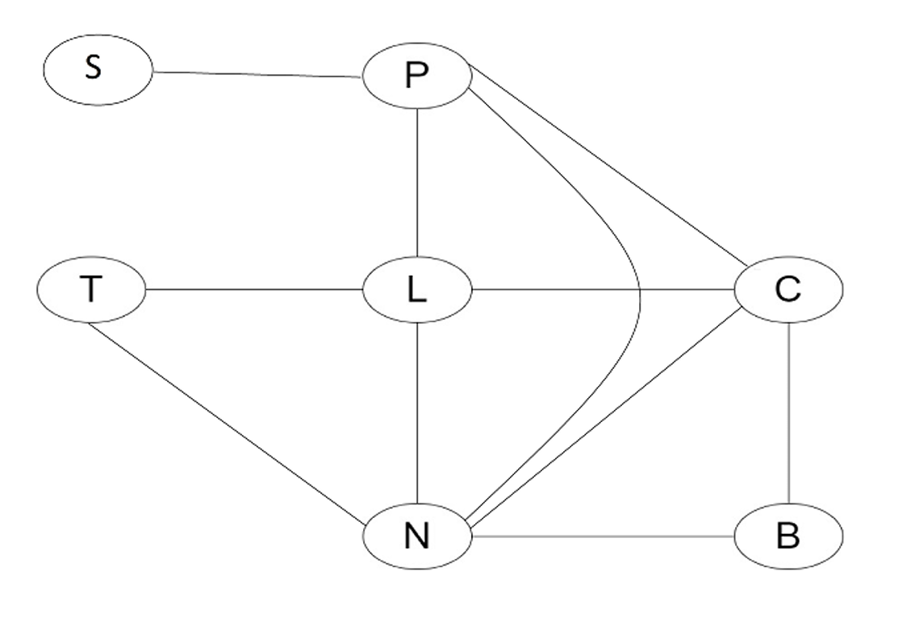

# AI Constraint Satisfaction Problem (CSP) Solver for Scheduling

Developed a Constraint Satisfaction Problem (CSP) solver in Python to generate valid schedules for a complex conference scenario involving multiple speakers, sessions, and time slots — each with distinct availability and dependency constraints.


## 🎯 The Problem: METU Time Machine Scheduler

The core challenge was to schedule 7 famous historical figures for a 4-slot conference (10 AM - 14 PM).

* **Variables:** 7 Speakers:
    * Alan Turing (T), Ada Lovelace (L), Niels Bohr (B), Marie Curie (C), Socrates (S), Pythagoras (P), and Isaac Newton (N).
* **Domains:** 4 Time Slots (10, 11, 12, 13).
* **Constraints:** A set of 7 rules based on attendee wishes and speaker availability. For example:
    1.  Turing **must** be in the 10 AM slot.
    2.  Physicists (Bohr, Curie, Newton) **must not** conflict, as PHY students want to see all three.
    3.  Mathematicians (Lovelace, Pythagoras, Newton) **must not** conflict.
    4.  ...and so on for AI students, the Society of Women Engineers, and other groups.

### Constraint Graph

This graph visualizes the problem. Each speaker is a node, and an edge connects any two speakers who are in the same constraint group and thus cannot be scheduled at the same time.



---

## ✨ Features & Algorithms Implemented

The solver is a versatile tool that allows a user to select from a suite of classic and heuristic-driven AI search algorithms to solve the problem.

1.  **Pure Backtracking:** The standard, uninformed search algorithm.
2.  **Backtracking with Forward Checking:** Improves on pure backtracking by pruning the domains of unassigned variables after each assignment.
3.  **Backtracking with Arc Consistency (AC-3):** (Implemented via Forward Checking in this version) A more powerful constraint propagation technique.
4.  **Backtracking with Heuristics:**
    * **Minimum Remaining Values (MRV):** A variable-ordering heuristic that selects the variable with the *fewest* remaining legal values in its domain.
    * **Degree Heuristic:** A variable-ordering heuristic that selects the variable involved in the *most* constraints with other unassigned variables.
5.  **Min-Conflict Local Search:** A non-systematic algorithm that starts with a full (but conflicted) assignment and iteratively tries to *reduce* the number of conflicts.
6.  **Step-by-Step Output:** The solver prints each variable assignment, allowing for visualization of the search path and any backtracking steps.

---

## 🔧 Generalized Solver

The solver is not hard-coded to the speaker problem. The program first prompts the user to define their own CSP. You can define:
1.  All **Variables** (e.g., "WA", "NT", "SA" for map coloring).
2.  The **Domain** for each variable (e.g., "red", "green", "blue").
3.  The **Constraints** (e.g., which variables cannot have the same value).

This makes the tool a flexible solver for classic CSPs like N-Queens or Map Coloring.

---

## 🚀 How to Run

1.  Clone the repository.
2.  Ensure you have Python 3 installed.
3.  Run the main script:
    ```bash
    python csp_solver.py
    ```
4.  **Define your CSP:** The program will first ask you to enter the variables, their domains, and the constraints.
5.  **Select a Solver:** Once the CSP is defined, the main menu will appear, allowing you to choose which algorithm to run.

### Example CLI Interaction

First, you define the problem (this example uses the built-in conference problem):

```
Enter name of variable, enter exit to finish: T
Enter domain of variable, enter exit to finish: 10
Enter domain of variable, enter exit to finish: exit
Enter name of variable, enter exit to finish: L
Enter domain of variable, enter exit to finish: 10
Enter domain of variable, enter exit to finish: 11
Enter domain of variable, enter exit to finish: 12
Enter domain of variable, enter exit to finish: 13
Enter domain of variable, enter exit to finish: exit
... (and so on for all 7 variables) ...

Taking input for constraints variables: enter -1 to finish adding all constraints.
Enter constraint variable name, enter exit to finish the current constraint: B
Enter constraint variable name, enter exit to finish the current constraint: C
Enter constraint variable name, enter exit to finish the current constraint: N
Enter constraint variable name, enter exit to finish the current constraint: exit
... (and so on for all 7 constraints) ...

Created the constraint satisfaction problem. 
```

Once the problem is built, the solver menu appears:

```
Select the scheduling technique:
1. Pure backtracking search algorithm
2. Backtracking search algorithm + forward checking
3. Backtracking search algorithm + Arc Consistency
4. Backtracking search algorithm + Degree Heuristic
5. Backtracking search algorithm + MRV
6. Backtracking search algorithm + Min-Conflict
7. Exit
Enter your choice: 1

T is assigned to 10, 
T is assigned to 10, L is assigned to 10, 
T is assigned to 10, L is assigned to 11, 
T is assigned to 10, L is assigned to 11, B is assigned to 10,s
T is assigned to 10, L is assigned to 11, B is assigned to 11, 
T is assigned to 10, L is assigned to 11, B is assigned to 12, 
... (solver continues until a solution is found) ...
```